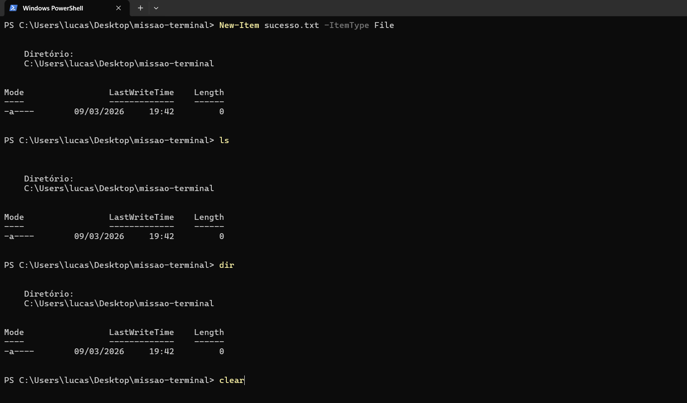

# ⚡ Meus Comandos Favoritos
Aqui estão os comandos que mais utilizei na aula de Terminal:

- `cd`: Para navegar entre pastas.
- `dir`: Para listar arquivos.
- 'New-Item': Para criar arquivos ou pastas.
- 'ls': Para listar arquivos e diretórios
- 'clear': Para limpar a tela do terminal.

## 📸 Evidência de Execução

